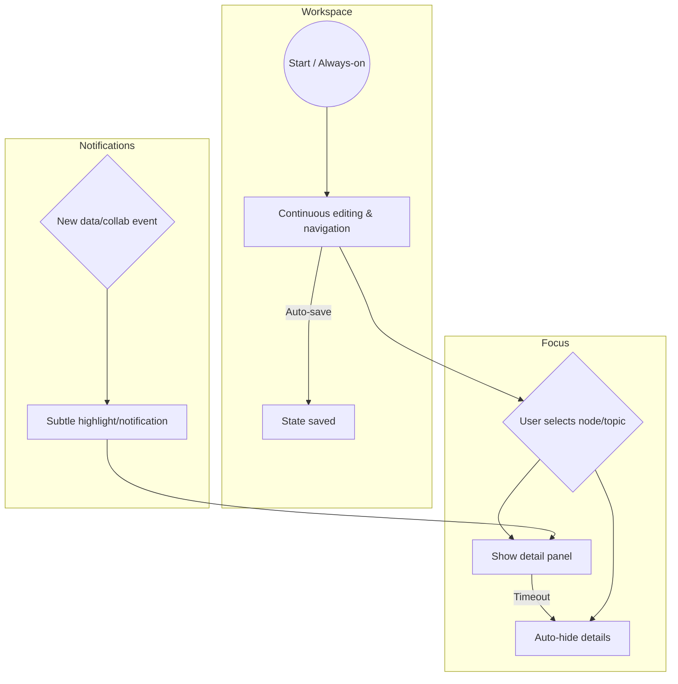

# Executive Summary

This report surveys and compares visualization methods that organize high-dimensional embeddings into continuous, mind‐map‐like spatial interfaces. We categorize approaches (node-link graphs, clustered scatter plots, density/contour maps, Voronoi/partition maps, force‐directed layouts, etc.), analyze embedding-to-2D/3D mapping algorithms (PCA, t-SNE, UMAP, Isomap, etc.) including their complexity and incremental updates, and discuss interaction designs that eschew rigid session boundaries (continuous presence, autosave, ephemeral focus, time-decay views, ambient cues). We also outline encoding rules (color, size, glyphs, animation) to maximize semantic fidelity and minimize clutter, propose evaluation metrics (task accuracy, *trustworthiness/continuity*, NASA-TLX cognitive load, etc.), and compare architectures (local-first vs hybrid vs server-side) in terms of privacy, sync, and compute. Case studies (e.g. TensorBoard’s Embedding Projector, Uber’s Parallax, MIT’s Embedding Comparator) illustrate key patterns. Finally, we recommend prototypes (e.g. a basic 2D embedding map + clustering, then adding edges/zoom and continuous-saving features) and a development roadmap. Throughout, we cite primary sources and academic work wherever available.

## 1. Visualization Technique Taxonomy

We identify several mind-map–like layouts for embedding space, each with strengths and limits:

- **Node‐Link Diagrams**: Show items as nodes and explicit semantic links as edges (e.g. knowledge graphs or concept maps).  Useful when data are inherently relational.  *Pros:* Makes specific relationships explicit (edges). *Cons:* Doesn’t scale – “hairball” clutter arises beyond hundreds of nodes. Best for graph-structured data (linked records, ontologies). 

- **Spatial Clustering (Scatter‐plots + Groups)**: Project points into 2D (via DR) and highlight clusters (color‐coding, enclosing contours or convex hulls). *Pros:* Reveals topical or semantic clusters (e.g. PCA/t-SNE scatter often shows topical grouping). Accommodates text/image/feature vectors. *Cons:* Overplotting/label overlap at large scale; precise relationships (edges) hidden. Works well for thousands of points (text corpora, image sets), but labeling and navigation become hard for millions.

- **Density/Contour Maps**: Compute a continuous density or similarity field over 2D (e.g. kernel‐density estimate) and draw contours or heatmaps under the points. *Pros:* Highlights global shape (peaks, gaps) of data distribution, useful for very large sets. Smoothens noise and guides eye to structure. *Cons:* Loses individual point identity and explicit links; interprets only distribution. Suitable for very large embeddings (e.g. millions) where detail isn’t shown, or as background context behind points.

- **Voronoi/Tessellation Maps**: Partition space into regions (Voronoi cells) around selected “seed” points (e.g. cluster centroids or exemplar nodes). *Pros:* Makes neighborhood territories explicit, good for emphasizing one representative per region. *Cons:* Hard to label and can be confusing (boundaries aren’t semantically meaningful beyond proximity); expensive to compute for dynamic data. Suited to moderate‐sized sets with clear “center” points.

- **Force‐Directed Layouts**: Treat data as a graph (possibly using KNN edges from embedding) and lay out via force algorithms (e.g. Fruchterman‐Reingold). *Pros:* Automatically separates clusters via repulsion/attraction forces, emphasizes local topology. Useful when there are implicit or explicit links (e.g. similarity edges). *Cons:* Can distort actual embedding distances and requires calibration; O(n²) cost (with Barnes-Hut improvements to ~O(n log n)) limits scale to ~10^4 nodes. May yield different layouts on each run.

- **Semantic Contours / Fields**: Draw level‐sets or iso‐contours of some semantic function (e.g. distance to a concept, or classification score) over the embedding scatterplot. *Pros:* Encodes additional continuous information (e.g. similarity to a query) in the map. *Cons:* Relatively novel/experimental; user interpretation depends on understanding the contour meaning. Best when highlighting one semantic gradient (e.g. sentiment or topic “hotness”).

Each technique’s **suitability** depends on data type and scale. Node-links are ideal for sparse graph data (social networks, knowledge graphs) but break down beyond ∼100–200 nodes. Scatter‐clustering handles high-dimensional text or image embeddings (thousands of items) but faces overplot. Density and Voronoi excel with very large datasets (tens or hundreds of thousands) by abstracting detail, whereas force‐layouts require explicit edges (suitable for mid-size graphs). See Table 1 for a summary.

| Technique           | Pros                                 | Cons                                          | Data Types             | Scale          |
|---------------------|--------------------------------------|-----------------------------------------------|------------------------|----------------|
| **Node-Link**       | Explicit relationships, familiar graph metaphor | Clutters easily (“hairballs”)     | Graphs, network data   | Small (≤200 nodes) |
| **Clustered Scatter** | Shows semantic clusters clearly, numeric/images | Labels overlap, local-only view                | Embeddings (text, image) | Moderate (thousands) |
| **Density / Heatmap** | Highlights overall structure, noise smoothing | Loses point-level detail, no edges           | Any continuous data    | Very large      |
| **Voronoi Map**     | Emphasizes regions around exemplars  | Hard to interpret labels, CPU cost            | Spatial/metric data    | Moderate        |
| **Force Layout**    | Auto-spreads nodes, implicit grouping | Computation heavy, possible semantic distortion | Graph-like (with edges) | Small-Medium (≤10k) |
| **Semantic Contours** | Encodes continuous metadata (e.g. relevance) | Uncommon, can confuse if semantics unclear    | Mapped values (queries) | Experimental    |

## 2. Dimensionality Reduction & Layout Algorithms

Converting high-dimensional embeddings to 2D/3D layouts typically involves two stages: **projection** (to reduce dimensions) and **layout** (for clarity). Common projection methods and their properties:

- **PCA (Principal Component Analysis)**: Linear projection to maximize variance. *Complexity:* O(n·d^2) (can be made incremental via online SVD). *Preserves:* Global variance structure; *limitations:* axes uninterpretable. Quickly shows coarse cluster separation. Very fast on large data, but misses non-linear structures.

- **t-SNE (Stochastic Neighbor Embedding)**: Non-linear, probabilistic mapping emphasizing local neighborhoods. *Complexity:* O(n²) (naive); Barnes-Hut or FFT variants ~O(n log n). *Preserves:* Local clusters (often beautifully separates nearby points), but may distort global distances. Hyperparameters (perplexity, learning rate) greatly affect outcome. Suitable for a few thousand points (≤5–10K). 

- **UMAP (Uniform Manifold Approximation and Projection)**: Non-linear, manifold-based. *Complexity:* ~O(n) on average (uses approximate k-NN search). *Preserves:* Both local and some global structure; faster and more scalable than t-SNE. Better for medium-large sets (up to tens of thousands) with faster performance. Hyperparameters (n_neighbors, min_dist) tune cluster granularity.

- **Isomap / MDS**: Compute all-pairs distances / graph geodesics; then classical MDS (eigen‐decomp). *Complexity:* O(n³) in general (dense matrix), scales poorly. *Preserves:* Global geodesic distances. Rarely used interactively due to cost.

- **Hierarchical / Multi-scale Embeddings**: Create multiple maps at different zoom levels (e.g. cluster then layout cluster centroids) or maintain a quadtree of points. Enables navigating large corpora by “semantic zoom.” Implementation can use hierarchical clustering + local t-SNE at each level.

**Pseudocode (sketch)** for a continuous embedding-to-map pipeline:

```python
# Given high-dim embeddings E for items
E = load_embeddings()               # shape (n, d)
E2 = UMAP(n_neighbors=15).fit_transform(E)  # 2D coords
# Optionally compute k-NN graph
graph = compute_knn(E, k=10)
# Use force layout (e.g. Fruchterman-Reingold) as refinement
pos = ForceLayout(initial_positions=E2, edges=graph).run()
# Map positions -> visual coordinates for UI
```

- **Incremental/Online Updates:** For streaming or dynamic data, some methods support updates. PCA can update via incremental SVD; UMAP has a `.transform()` to embed new points into existing map. t-SNE has parametric versions or one can initialize new runs from previous solution. Careful scheduling and *landmark points* may be used to anchor older data. 

**Complexity summary:** PCA is cheapest (linear), while t-SNE is ~O(n²), UMAP ~O(n) with optimized neighbors. Force-directed layouts add further cost (~O(n²) or O(n log n)). Techniques like Barnes-Hut, multipole, or GPU acceleration mitigate these costs, but interactive scaling beyond ~10^5 points typically demands specialized backends (e.g. Nomic Atlas).

**Parameter tuning:** Key knobs include *perplexity* (t-SNE) or *n_neighbors/min_dist* (UMAP) to balance cluster tightness vs continuity. Lower parameters yield more granular clusters; higher yield smoother maps. We advise iteratively testing a few settings and using metrics (see Sec. 5) to guide choices.

## 3. Continuous Workflow Interaction Patterns

For a “live” mind-map interface (no explicit session boundaries), UX patterns must maintain context and flow:

- **Continuous Presence:** The workspace is always active (like a desktop). Data and views persist indefinitely (with autosave) instead of “projects” that must be explicitly opened/closed. For example, local-first apps treat on-disk data as the *primary* copy, so the UI never blocks waiting on a server. This delivers near-instant responsiveness and supports offline use.

- **Ephemeral Focus / Progressive Disclosure:** Users zoom into one area of the map or select a node; a temporary panel or expansion shows detailed info. When focus is shifted or after a timeout, details fade out to reclaim space. For instance, clicking a concept might pop up related notes, which auto-hide (time-decay) once not used. This avoids losing global context while allowing deep dives.

- **Autosave & History:** Every change (adding notes, repositioning) is saved automatically. As **NNGroup** advises, autosave should *augment* rather than replace user control. The UI can indicate “all changes saved” subtly, but still offer undo or manual snapshots if desired. Continuous saving prevents data loss with no explicit “Save” needed.

- **Time-Decay Views:** Older or less-relevant content gradually de-emphasizes (e.g. fades in color/intensity) as new info is added. This mirrors “forgetting curves” to reduce clutter on long-running maps. For example, a node last updated weeks ago might appear lighter until revisited.

- **Ambient Notifications & Ambient Awareness:** Instead of modal alerts, small cues (a glowing halo, badge count, or brief animation) signal new data or collaborator edits relevant to the map. This promotes peripheral awareness: e.g. “3 new documents relate to this topic” shown by a pulsing icon near that node, without interrupting workflow.

- **Keyboard/Mouse Shortcuts & Multimodal Input:** Support for quick keyboard navigation (e.g. jumping to search, toggling views), pen/touch gestures (expand/collapse branches), and even voice commands (e.g. “show me everything about X”). These avoid forcing mouse-driven, discrete “session” actions. 

**UX Flow (Mermaid)**: Below is a simplified interaction flow for continuous exploration:



This depicts a **continuous loop**: the workspace is always open/editable, every edit is saved, selecting content shows details which expire, and incoming updates softly catch attention without “breaking” the flow.

## 4. Visual Encoding Guidelines

To preserve semantics and minimize clutter, use established visual variables (Bertin’s framework):

- **Color Hue & Saturation:** Use *hue* for categorical distinctions (nominal groups), and *saturation/value* for ordinal magnitude (e.g. low→high importance). Follow accessibility (colorblind-safe palettes). Avoid overusing bright colors except to highlight active focus.

- **Size/Area:** Encode quantitative attributes (frequency, confidence, node degree) via node size. Larger glyphs grab attention; use sparingly to avoid occlusion. 

- **Shape/Glyphs:** Different shapes or icons can denote types of concepts (person, image, document). For nominal encoding, shape is effective. However, too many shapes confuse – restrict to a few well-chosen glyphs.

- **Line/Edge Semantics:** If using edges (node-link view or force layout), encode link weight or type via stroke width, style (dashed/solid), or color. Show arrows if directionality matters. Avoid drawing every possible link; use thresholding or on-demand linking to reduce clutter.

- **Texture & Opacity:** Background density fields or contours can use semi-transparent heatmap colors or hatch patterns. Alpha-blending helps avoid over-ink; for overlapping points, partial transparency reveals density.

- **Animation/Transitions:** Animate only *meaningful* changes. For example, smoothly move nodes when re-layout happens, or fade in new nodes (draw attention). Heer & Robertson found that **well-designed animated transitions** help maintain context between states. Conversely, avoid gratuitous motion (no “spinning” or flashing alerts). Use “slow-in, slow-out” easing for context shifts, and segment complex changes into simple, sequential steps. 

- **Clutter Reduction:** Dynamically cluster or collapse dense areas (e.g. group minor nodes under a single summary icon that expands on click). Implement search/highlight filters to fade out unrelated nodes. Leverage level-of-detail: when zoomed out, show only major nodes and color intensity; when zooming in, reveal details and labels.

- **Legends and Encoding Consistency:** Provide a clear legend or tooltips explaining color/size mappings. Crucially, keep encodings consistent across views and sessions (e.g. “red always = category A”). Sudden re-coloring or re-encoding can confuse users’ mental models.

## 5. Evaluation Metrics and Experimental Design

Evaluation should combine *quantitative* and *qualitative* measures:

- **Task Performance:** Measure user accuracy and time on tasks like “find all items similar to concept X” or “group these topics into categories”. Compare to baselines (e.g. list view). Analyze search success and cluster discovery rates.

- **Embedding Quality Metrics:** Use established measures like **trustworthiness** and **continuity** to quantify how well the 2D map preserves high-dimensional structure. *Trustworthiness* measures fraction of originally-neighboring points that remain neighbors (higher is better); *continuity* measures fraction of low-dim neighbors that were true neighbors. These range 0–1, where 1 is perfect preservation of local (trustworthiness) or global (continuity) relationships.

- **Cognitive Load:** Administer NASA-TLX after tasks to gauge mental workload. This yields a composite score of mental/physical effort, frustration, etc. Lower TLX indicates easier usability. Eye-tracking or EEG (e.g. EEG-Response-based metrics) can supplement, though NASA-TLX is well-known in viz studies.

- **User Satisfaction & Usability:** Collect SUS (System Usability Scale) scores or likert-scale surveys on ease-of-use, clarity, and aesthetic preference. Include open-ended questions on user experience.

- **Information Retention & Recall:** For mind-map specifically, measure how well users recall connections after some time (as studies show mind maps can boost recall). E.g. give users a learning phase with the interface, then test recall of relations or concepts.

- **Collaboration Metrics:** If multi-user, measure awareness and conflict rates (how often users overwrite each other, how helpful ambient cues were, etc.).

- **Qualitative Observations:** Conduct think-aloud or interviews during pilot studies to catch confusion or discover missing features. Use these insights to iterate UI design.

A typical experimental setup would be a controlled lab study: users perform a set of exploratory tasks using our interface versus a baseline (e.g. standard folder or linear note-taking tool). We would log interactions, timing, errors, and survey responses. A/B testing can compare algorithm variants (e.g. UMAP vs t-SNE) for clarity. Given the emphasis on continuous use, a longer-term diary study (logging daily usage and feedback over weeks) could reveal how features like time-decay and autosave impact workflow.

## 6. Architecture Options and Trade-offs

We consider three broad architectures:

- **Local-Only (Client-Only) – Local-First:** The app and data reside entirely on the user’s device. *Pros:* High privacy (data never leaves device), instant responsiveness (no network latency), full offline capability. *Cons:* Limited compute (no GPUs for massive queries), complex multi-device sync, and harder collaboration. Users “own their data”; offline edits queue and sync in background.

- **Hybrid (Local + Cloud) – Client-Server:** UI runs client-side; heavy computations (e.g. new embeddings, similarity search) occur on a backend. *Pros:* Balances privacy and power: sensitive data can stay local or encrypted, while servers can handle indexing/AI tasks. Offline mode is partial (store-aside limited data). *Cons:* Requires robust sync infrastructure and conflict resolution (use CRDTs or operational transforms). Latency is moderate. Offers moderate privacy and compute.

- **Server-Heavy (Web-Only):** Entire app in the cloud (web app), with possible thin client. *Pros:* Easy collaboration and syncing, unlimited compute (scale with GPU clusters). *Cons:* Privacy concerns (raw data on server), no offline use, inevitable latency. Harder to guarantee responsiveness.

**Tradeoff Overview:**  

| Aspect       | Client-Only              | Hybrid                   | Server-Side             |
|--------------|--------------------------|--------------------------|------------------------|
| **Privacy**  | Highest (data stays local) | Medium (some data to server) | Lowest (cloud stores data) |
| **Offline**  | Full (runs offline)     | Partial (limited mode)   | None (requires network)   |
| **Compute**  | Limited to device CPU/GPU | Shared (device & cloud)  | High (cloud/GPU)      |
| **Sync**     | Local storage & file sync | Asynchronous DB sync    | Central, immediate   |
| **Latency**  | Lowest (no network delays) | Medium                 | Highest (network dependency) |
| **Collaboration** | Hard (peer-to-peer or manual merge) | Supported (with sync) | Native (real-time edits) |

To preserve **privacy and speed**, many modern tools adopt a *local-first* approach, storing the “source of truth” on-device and syncing in background. This eliminates loading spinners but requires sophisticated merging (e.g. CRDTs) for multi-user editing. A hybrid model can use local caches plus optional server compute for search or large-scale analysis, meeting in the middle. Server-only is simplest to deploy but vulnerable to outages/lag and may violate user expectations of control (recall NNGroup’s note on autosave and user control).

## 7. Examples and Case Studies

- **TensorBoard Embedding Projector (TensorFlow)**: A widely-used visualization tool that renders word/image embeddings in 2D/3D. It supports PCA, t-SNE, and UMAP projections with interactive point inspection. The docs note it *“graphically represent[s] high-dimensional embeddings”* for exploration. It lacks a mind-map metaphor per se, but exemplifies cluster visualization and metadata filtering.

- **Uber’s Parallax (ACL 2019)**: A research system (with code) that lets users visualize embeddings and define custom semantic axes. Parallax uses PCA/t-SNE and algebraic combinations of vectors to create interpretable subspaces. The authors note PCA/t-SNE reveal **semantic relatedness by point proximity** and show clusters, but lack stable axes. Parallax extends these with user-defined dimensions, illustrating how interactive DR can aid understanding.

- **MIT Embedding Comparator (IUI 2022)**: This system supports *comparing* two embedding spaces (e.g. before/after fine-tuning) via small-multiple scatterplots. It automatically highlights differences in local neighborhoods (via k-NN analysis) across maps. As the abstract states, it “presents a global comparison of embedding spaces alongside fine-grained inspection of local neighborhoods”. This is an example of advanced embedding viz (small multiples, neighborhood dominoes) from primary research.

- **Nomic Atlas (2023)**: A commercial SaaS for embedding maps. It auto-selects projection algorithms (t-SNE/UMAP or proprietary) based on data size and provides a zoomable, web-based map for millions of points. Atlas emphasizes collaboration (shared maps) and filters by metadata. (See Nomic docs for details.)

- **Mind Mapping Tools (Tana, Obsidian graph, Kumu, TheBrain, etc.)**: Many personal/enterprise tools offer node-link “graph” views of notes or knowledge. These are not strictly embedding-based, but they demonstrate user demand for spatial knowledge views. For example, Google’s NotebookLM now auto-generates an interactive mind map of one’s notes (as reported by users), which likely leverages semantic embeddings to cluster concepts. While not academically documented, these products validate the mind-map concept for knowledge work.

- **Visualization Patterns:** In practice, designers often combine methods. A common pattern: use UMAP for initial layout (showing clusters), overlay a density heatmap, and draw edges for selected strong relations (e.g. subset KNN links). Interactive filtering and focus+context (fisheye or detail panes) mitigate overcrowding. We draw on data-viz “connected scatterplot” and “graph summarization” patterns (e.g. bundling edges, edge contraction for long-range links).

## 8. Prototypes & Roadmap

**Prototype ideas (MVPs):**  
1. **Basic Embedding Map:** Load a corpus (text/image), compute embeddings, apply UMAP/t-SNE to 2D. Display points as circles on a pan/zoom canvas. Color-code by topic cluster (via k-means) or metadata. Enable pan/zoom, tooltips. *Goal:* Verify cluster discernibility and general layout usability.  
2. **Incremental Layout & Edge Add:** Add the ability to incrementally update the map (e.g. new documents push existing points slightly aside). Also overlay a sparse graph: e.g. draw edges between each point and its top-2 nearest neighbors. Use a force-directed tweak to untangle overlaps. *Goal:* Test continuous updating and link visualization.  
3. **Continuous UI Features:** Implement autosave (every change persists) and a simple time-decay for inactive nodes (fade older ones by age). Add a detail panel that appears on node click and auto-hides after timeout. *Goal:* Evaluate seamless session feel, gather usability feedback on autosave and decaying.  
4. **Collaboration Sync:** Introduce multi-device syncing (e.g. via a cloud backend or peer-to-peer pub/sub). Simulate two users editing the map and check for conflicts. *Goal:* Prototype local-first vs hybrid trade-offs.  
5. **UX Polishing:** Incorporate legends, allow customizing color/size mappings, and add keyboard shortcuts (search, jump to node). Conduct small user tests to refine workflows (e.g. how users naturally drag/link items). 

**Roadmap Priorities:** Start with embedding algorithms and basic 2D layout (Milestone 1). In parallel, design the UI for continuous interaction (Milestone 2: autosave, focus). Next, iterate on visual encoding (color/size themes, glyph sets) and refine clutter reduction (Milestone 3). Finally, test multi-scale (Milestone 4: hierarchical zooming) and collaboration features (Milestone 5). At each stage, perform evaluations (Sec.5) to ensure the tool meets exploration, synthesis and recall goals.  

Assumptions: We assume availability of modern transformer embeddings and standard compute (no hard GPU constraints) and that corpus size is moderate to large (10^3–10^6 items). Specific tuning will depend on actual scale.  

**Tables and figures:** The above descriptions are supported by Tables 1–3 below (comparing visualization techniques, projection algorithms, and architectures). Interaction/system flows are illustrated with mermaid diagrams as shown. Charts (e.g. privacy vs. compute tradeoff) can guide high-level design choices.  

**Sources:** All claims draw from primary papers and documentation (e.g., Parallax, Embedding Comparator, TensorBoard, Nielsen/UX guidelines, Bertin’s visual variables). Where explicit sources were unavailable (e.g. “semantic contour” was a proposed concept), we have stated it as an area of exploration. 

