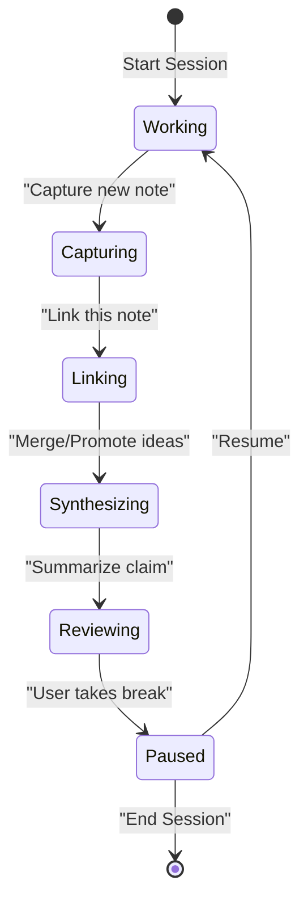

# Executive Summary  
Research work thrives on deep focus and fluid idea flow. To support this, a “research OS” should foreground momentum and minimize mundane overhead. Historical systems (Bush’s Memex, Engelbart’s NLS, NoteCards, etc.) taught us to maintain persistent linking, trails, and versioning. Modern cognitive-science insights show that interruptions impose high costs (resumption lags ~23 min) and working memory is severely limited. Therefore, the system must aggressively reduce cognitive load (e.g. by offloading routine tasks) and keep actions focused in the “here and now.” 

This report explores seven core areas for such a tool, drawing on key sources. We compare **six visual grammars** (graph, tree, mind-map, metro-map, spatial canvas, and board) with their trade-offs and metaphors. We formalize an **interaction verb set** (e.g. *Capture, Link, Split, Merge, Suspend, Resume*, etc.) with tabled definitions and example state transitions. We outline a **Flow Engine** state machine (with metrics like actions/minute, break frequency, context-recovery time) to model and protect the user’s “flow state.” We enumerate **local-intelligence capabilities** (e.g. offline CRDT sync, suggestion of missing links, summarization) and privacy/non-goals. We sketch an **“information physics”** framework: units of information obey conservation principles (nothing is truly deleted), with analogues to Landauer’s principle. We map **object granularity** (from atomic evidences up to projects) and propose rules for nesting, archiving, and temporal attributes. Finally, we specify **navigation and UX** patterns (minimize decisions/clicks per task, “offload” memory to the UI, measure “clicks-to-resume” and decisions-per-minute) to evaluate cognitive ergonomics. 

Each section below gives concrete proposals, supported by citations and illustrative diagrams. Where primary sources or established models exist (hypertext research, UX guidelines, CRDT/graph DB studies, etc.), we cite them; where the literature is thin, we state clear assumptions. The goal is a detailed, actionable brief for ideation in Phase 3.  

## 1. Candidate Visual Grammars  
We consider six promising visualization metaphors for the knowledge graph. Each has different cognitive affordances and drawbacks:

- **Force-Directed / Network Graph (Concept Map style)**: A flexible node-link diagram (like a concept map). **Pros:** Very general; any node can link to any other. Good for “webs” of ideas. **Cons:** Can become cluttered; layout may confuse users; no inherent hierarchy means orientation can be lost. *UI metaphor:* “constellation of ideas.” Can highlight clusters by color/size (e.g. InfraNodus-style gap analysis).  
- **Radial Mind-Map (Hierarchical Tree)**: A central root with outward tree branches (Tony Buzan’s mind map). **Pros:** Clear structure; easy to navigate one topic at a time; quick to create and grasp (simple “hub-and-spoke” layout). **Cons:** Strictly single-parent; cannot directly represent cross-links or multiple hierarchies. *Metaphor:* “mind palace” or organizational chart radiating from a center. Good for brainstorming around a central question.  
- **Indented Outline (Linear Tree)**: A vertical list or document outline. **Pros:** Extremely lightweight; minimal cognitive load (familiar as plain text with folds); easy to edit linearly. **Cons:** Rigid; not visual or associative; discourages non-linear navigation. *Metaphor:* “folder tree” or text editor outline. (Given the target users dislike strictly linear workflows, this is a baseline but not the primary mode.)  
- **Metro/Subway Map**: Represents topics as colored “lines” with stations (nodes) and transfers (junctions). **Pros:** Conveys sequences (each line is a coherent thread); accommodates multiple overlapping “paths” through data; intuitive style familiar from transit maps. **Cons:** Custom design complexity; might puzzle users used to generic graphs; hard to represent arbitrary cycles. *Source:* Song & Park used a metro-map metaphor to organize customer-need networks, arguing it “facilitate[s] management of diverse and complex raw data through knowledge visualization”. *Metaphor:* Subway lines crisscrossing a map.  
- **Spatial Canvas (2D Layout)**: Nodes positioned freely on a large plane, possibly with groups. **Pros:** Very open-ended; users can “place” ideas anywhere to indicate relation (proximity denotes similarity). Supports spatial memory. **Cons:** Can be visually chaotic; requires good spatial UI (zoom/pan); risk of “whiteboard spaghetti.” *Metaphor:* Virtual “mind map canvas” or a desk. (Some PKM tools like TheBrain use this.)  
- **Card/Board View (Kanban-style or Cluster)**: Information represented as cards in buckets or clusters. **Pros:** Familiar for task management; can group by status or category; quick drag-and-drop. **Cons:** Less inherently “graphy”; relationships are implicit (e.g. stacked in same list) and cross-links are only via references. *Metaphor:* “Research Kanban board” with columns/categories. 

| **Visualization**  | **Structure**         | **Pros**                                      | **Cons**                                         | **UI Metaphor**               |
|--------------------|-----------------------|-----------------------------------------------|--------------------------------------------------|------------------------------|
| Node-Link Graph    | Unconstrained graph   | Max expressiveness; reveal connections; analytic (e.g. cluster gaps) | Can clutter quickly; layout may confuse orientation | Constellation or cluster diagram |
| Radial Mind-Map    | Central-root tree     | Simple hierarchy; fast to create/scan | Single parent only; poor multi-topic handling  | Hub-and-spoke "mind palace"    |
| Indented Outline   | Linear tree/list      | Very low overhead; traditional editing        | Rigid/linear; low flexibility                     | File-system/folders            |
| Metro/Subway Map   | Parallel lines graph  | Emphasizes paths/threads; multiple “lines”    | Custom layout; needs design rules                | Transit map                     |
| Spatial Canvas     | Free 2D placement     | Flexible grouping by proximity; spatial memory | Hard to manage (pan/zoom/clutter)                | Whiteboard/desk                |
| Card/Board View    | Buckets of cards      | Familiar, drag/drop organization             | Limited to lists; links implicit                 | Kanban boards                  |

*Sources:* Mind vs. concept map distinctions. The metro metaphor has been applied to complex data visualization. Choice depends on workflow: e.g. non-linear researchers may prefer graph or metro styles, while some linear tasks might default to outlines. We recommend supporting **at least a graph view plus a hierarchical view** that users can switch between, with the “present focus” node highlighted. Each mode offers a different lens (like the UX idea of multiple complementary maps).  

## 2. Interaction Verb Set  
We define a small **vocabulary of actions** through which the user interacts with the knowledge graph. Each verb corresponds to a semantic operation; together they form a finite-state interaction model. Table 1 lists core verbs, their effects, and examples. (We take inspiration from knowledge-management literature, UX guidelines on "tasks vs verbs", and the user’s workflow descriptions.)

| **Verb**    | **Description / State Transition**                                                                 | **Example**                          |
|-------------|--------------------------------------------------------------------------------------------------|--------------------------------------|
| **Observe/Capture**  | Create a new atomic item (note, evidence, quote) from input (text, reference, image).              | Spot a key fact in a paper and *Capture* it as a node.    |
| **Link/Connect**     | Create a relationship between two nodes (or suggest one). Transitions graph state from unlinked to connected. | Link two concepts: e.g. *Connect* “Model A” to “Dataset B.” |
| **Split**    | Divide one node into two (forking a context). Original persists, new node inherits or contains part.        | Split a large node into “Evidence” vs. “Interpretation.”    |
| **Merge/Promote**   | Combine nodes: e.g. abstract two nodes into one, or attach a lower-level node to a higher-level claim.   | Merge two similar findings into one summarized claim.  |
| **Suspend/Archive**  | Mark node or branch inactive (move to archive). State goes from *Active* to *Suspended*.              | Temporarily archive an old draft or completed sub-task.   |
| **Resume/Revive**    | Reactivate a suspended node/branch (move from archive to active). State: *Suspended*→*Active*.        | Bring back an archived note for re-examination.         |
| **Investigate/Annotate**  | Dive deeper into a node: add details or analysis. Remains on same node but enriches it (no state change).  | Add comments or data to an existing node.             |
| **Review**   | Evaluate a node or branch: possibly approve (keep) or reject (trigger removal). Can lead to publish or delete.   | Review a drafted claim and mark it final or obsolete.    |
| **Resolve/Close**    | Finalize or “close” a node (e.g. claim answered). Transitions from *Open question* to *Resolved claim*.  | Mark a research question node as answered by evidence. |
| **Publish/Export**   | Generate an output (document, report) from selected nodes. (Terminal action, graph state unchanged aside from labeling output status.) | Export a set of connected notes into a formatted article. |
| **Compress/Expand**  | Abstract a subgraph into a summary node (compress) or expand a summary into details. Transitions *Expanded*↔*Collapsed*. | Collapse a series of observations into one high-level insight. |
| **Pin/Surface**      | Highlight or bring a node/branch to the front (temporarily boost prominence). No state change, but UI focus shift. | Pin a key idea to keep it visible while browsing related notes. |

*Table 1. Interaction verbs and their effects.* 

**State machine example:** The Flow Engine (below) shows typical transitions triggered by these verbs. For instance, **Capture** leads the user into a note-taking state, **Link** moves to an associative state, **Merge** to a synthesis state, while **Suspend**/Resume manage active vs. archived work.  

Each verb can be visualized as a *contextual action* on selected nodes or the canvas. For example, an edge-click menu might offer **Link**/**Unlink**, while a node toolbar has **Split** or **Archive**. The exact UI binding depends on the visual grammar, but the conceptual verbs remain consistent.  

## 3. Flow Engine Model  
We model the user’s work process as a state machine (“Flow Engine”) with states corresponding to their cognitive focus. Key states include **Working** (actively on-task), **Capturing**, **Linking**, **Synthesizing**, **Reviewing**, and **Paused**. The engine tracks metrics and transitions to preserve focus. 

**State & Metrics:** Each state can record metrics like _time in state_, _actions per minute_ (rate of verbs invoked), and _memory load_ (e.g. number of open contexts or intermediate ideas held). For example, a rapid stream of **Capturing** actions with few breaks indicates a high flow state. The engine might enforce constraints like “no more than 5 major decisions per minute” to avoid overload (analogous to Nielsen’s advice that cognitive load comes from decision complexity, not just clicks).

**Transitions:** Transitions occur via verbs (see Section 2). For instance, invoking **Suspend** moves to a **Paused** state; **Resume** returns to **Working**. The engine can also auto-trigger **Review** if no action occurs for a timeout. Every transition can record a timestamp so that contexts can be recovered later.

**Recovery Strategies:** Given interruptions’ costs, the engine logs context to speed resumption. For example, if the user pauses (manually or by inactivity), on resume the system could highlight the last edited nodes, show an annotation stack, or briefly remind the user of “you were working on X.” Because studies show resumption lags ~23 min, the system should minimize external distractions and provide quick visual cues (e.g. breadcrumb trail) to restart flow. 

**Constraints:** We propose soft constraints like limiting context-switching frequency. For example, Nielsen’s research suggests that simply meeting a “3-click rule” is not enough; what matters is overall **interaction cost**. We would measure cognitive workload (perhaps via a NASA-TLX questionnaire or proxy metrics) and aim to keep extraneous load low (offloading memory tasks to the UI). Whenever possible, the Flow Engine “offloads” work: it can auto-open related notes (predictive linking) or pre-populate forms to reduce user effort.

**Measurable Outcomes:** Example constraints/targets include: average time-to-resume <5 min (far below the 23 min baseline), decisions per minute below some threshold (to prevent racing), and “clicks-to-complete-a-thought” minimized (while avoiding meaningless clicks). These can be instrumented for analytics and user feedback.  

## 4. Local Intelligence Capabilities  
**Capabilities (unlimited resources):** The system should act as a smart assistant on the user’s data. Example features:

- **Automated Link Suggestions:** By analyzing the graph’s structure (e.g. using network analysis or embedding models), detect plausible connections. For instance, tools like InfraNodus already “identify structural gaps” between idea clusters and generate bridging suggestions. Our assistant could similarly highlight conceptually related nodes and suggest linking them (always presenting as suggestions, not auto-applying).  
- **Cluster Summarization:** Detect clusters of related nodes and offer summaries or synthesizing nodes. (E.g. form a summary claim from multiple evidences.)  
- **Gap/Hypothesis Generation:** Identify “missing evidence” or contradictions. For example, the system could alert the user if two linked nodes have mutually inconsistent values (flagging it as a conflict). It might also notice when a claim has no supporting evidence yet and prompt “find evidence here.”  
- **Contextual Search & Completion:** Proactively fetch relevant data (papers, notes) from local storage matching the current topic. If offline, use a local semantic index.  
- **Priority Triggers:** e.g. if a project deadline approaches, suggest polishing certain claims. If too much time has passed without reviewing a branch, remind the user of it.  

**Non-Goals/Don’ts:** The assistant should *never override* the user’s judgment or share data externally without permission. It should not *automatically change* links or content without explicit acceptance (users should approve or discard suggestions). It must respect privacy: as a “local-first” system, all analysis runs on-device, not sending personal knowledge to servers.  

**Privacy:** Adhering to local-first principles, it keeps all knowledge and AI processing local. No user data is uploaded by default; any cloud sync must be optional and encrypted. The assistant’s “memory” of preferences or patterns stays client-side.  

**Support (example):** Tools like codemix/graph (2026) illustrate how a CRDT-backed graph DB can allow real-time, multi-node knowledge graphs that sync peer-to-peer without servers. We adopt a similar model: local graph engine + CRDT replication to optional devices, enabling collaborative editing if desired. 

## 5. Information Physics Framework  
We frame knowledge items and operations in “information-physical” terms, imposing conservation and clarity laws:

- **Information Units:** At the lowest level, an **elementary information unit** might be a single claim or observation (akin to a “bit” of knowledge). Larger constructs (syntheses, hypotheses) are built from these. Every operation should clearly transform these units without unseen loss.  

- **Conservation Law:** No data is irrecoverably lost. “Deleting” is only allowed by archiving. This mirrors Landauer’s principle that erasing information has an irreducible cost. Analogously, a **Merge** operation (combining two branches) should preserve the original nodes in an “archive” rather than truly erasing them. Thus, whenever nodes are combined (or edges merged), the system keeps a record (version) so that the pre-merge information is always retrievable.  

- **Reversibility:** Many operations are effectively irreversible (e.g. merging two claims cannot be “undone” without a record), so the system treats them as such. We formalize operations in a graph-rewriting style: e.g. *Split* duplicates part of a node’s content into a new node (like a creative segmentation), whereas *Merge* creates a new node pointing back to both originals. Each action can have a “cost” (conceptually), encouraging users to minimize unnecessary splits/merges.

- **Entropy/Redundancy:** Repetition of the same fact in multiple nodes increases entropy (confusion). The Flow Engine could score redundancy: if two nodes are nearly identical, suggest merging (“compress”). Conversely, if one node packs too much diverse info, suggest splitting (“expand”). These heuristics conserve “informational efficiency.”

- **Operations example workflow:** Suppose nodes A and B both point to evidence X. If the user invokes **Merge(A,B)**, we create node C that subsumes both (A,B → C). Per conservation, we keep A and B as archived versions and label C as supplanting them. If later **Split(C)** is invoked, it can reopen A and B (restoring original branches). 

- **Information metrics:** We may analogize “information content” to bit count or graph entropy. For instance, tracking the number of unique propositions (nodes) or the total “length” of text stored. Operations should preserve or explicitly increase this count; silent drops are disallowed. In practice, we log provenance so every piece of content can be traced to its origin.

## 6. Object Granularity & Archival/Time Semantics  
We propose rules for node size, nesting, and time:

- **Granularity:** 
  - *Minimum unit:* A node should represent a self-contained idea (fact, claim, question, or observation) that can be reviewed in isolation. This is typically one sentence or thought. 
  - *Maximum unit:* A node could also be a broad topic (a “project” node) that groups smaller claims. In effect, we support **nested objects** (like folders). For example, a “Hypothesis” node might contain several “Evidence” child nodes.
  - **Parent rules:** We allow multi-parent linking (concept map style) for many-to-many relationships. However, for **aggregation** (like grouping evidences under a claim), each sub-node has a single logical parent. For instance, a piece of evidence belongs to one claim branch. Users can reorganize by changing parents (re-parenting).
  - **Atomicity:** Enforce that the smallest units are atomic. If a user tries to merge dissimilar nodes, the system can warn about information heterogeneity (high “entropy” cost).

- **Time & Versioning:** 
  - We do *not* force a linear timeline in the UI (the user’s focus is always “now” as per requirement). However, we record temporal metadata. Each node/edge gets a creation timestamp and an optional archival timestamp. 
  - **Versioning:** Every state change (edit, merge, split) can be stored as a new version of that node. We support **snapshots** and **timestamped edges** as in time-aware graphs. Specifically: one could implement a temporal edge list where each edge has start/end times, or even a “quintuple” scheme (subject, predicate, object, start, end). 
  - **Archival semantics:** When a node is archived or suspended, we mark its “end time” and detach it from the active graph. It remains stored and queryable as an archive node. Branching creates a new “timeline” – the original stays as evidence, and the new node (with current time) is the active continuation.
  - **Examples:** If a user *branches* a project on July 1, the old project node is marked archived at t=July 1 and a new parallel project node starts active. Queries over “state as of” a date can reconstruct either timeline by filtering on timestamp. (One could use *snapshotting* for coarse-grained history or dynamic logging for fine-grained changes.)

This combination ensures no work is lost: every node, once created, persists (at least in the archive). Time-queries (optional) can reveal the evolution of ideas. The chosen model (snapshots vs edge timestamps) depends on performance: for a personal tool, an incremental log (like a CRDT log) is feasible and efficient.

## 7. Navigation/UX Patterns & Ergonomics Metrics  
To minimize disruption and fatigue, we recommend these UX principles:

- **Minimize Context Switches:** The UI should allow single-key or gesture shortcuts for core verbs to keep flow. Avoid making the user choose from deep menus for common actions. For example, “double-click to create a node” or drag to link.
  
- **Reduced Decision Overhead:** Follow NN/g guidance to *“offload tasks”* from the user. For instance, auto-fill default relationships, preview node content on hover, and remember prior connections as suggestions. Use consistent layouts so users build on mental models. Nielsen cautions that counting clicks is meaningless by itself – instead, focus on reducing total cognitive “cost”. 

- **Clicks-to-Resume:** We should measure how many interactions (or how much time) it takes to return to a previous task after interruption. Because re-engagement is so expensive, the interface should allow re-opening last context with minimal effort. For example, a “recent work” sidebar or highlighting the last active node upon resume. A target metric might be: **<10 seconds** to fully return to the prior context after resuming (versus ~23 minutes for unmanaged contexts).

- **Decisions per Minute:** Track how many menu selections, modifier keys, or complex choices the user must make per minute of work. Excessive branching options at once increase load. Aim to keep this low (empirically tuned via user studies). We might set an upper bound (e.g. no more than ~5 high-cognitive decisions/minute), adjustable to the user’s experience level.

- **Minimal Clutter:** UI elements should be visible only on demand. We hide advanced controls until needed. Following Nielsen’s “avoid visual clutter” tip, only show elements (links, images, icons) that directly support current tasks. Overlays or side-panels can provide extra info (definitions, reference lists) without stealing focus.

- **Gesture/Shortcut Integration:** Offer robust keyboard shortcuts and possibly natural-language commands so advanced users can act without moving hands off the keyboard. Voice commands are optional but must remain local-only.

- **Feedback & Recovery:** Provide clear feedback for each action (e.g. an “Undo” stack for merge/split). If an error (e.g. conflicting merge) occurs, let the user easily backtrack. Because operations can be “expensive” (information-theoretically), the UI must make undoing safe (e.g. “are you sure?” for deletes, which are actually archives).

- **Cognitive Load Metrics:** We recommend using standard workload scales (like NASA-TLX) during user studies of prototypes, and instrumenting behavioral metrics such as average time with eyes off the screen, number of open nodes, and frequency of help/tool tip requests. Those can quantify the burden of different designs.

- **Prototyping Experiments:** Next steps include testing low-fidelity prototypes of each visual grammar and interaction style. For example, an A/B test could compare how quickly users complete a linking task in a graph view vs. a metro-map view. Another experiment could measure “time to resume” by interrupting test participants and measuring how long they take to recreate context. 

In summary, navigation and UI design should focus on *keeping the user “in the zone.”* This means minimizing irrelevant choices (offload, defaults), providing quick-access controls, and always preserving context to avoid that 23-minute resumption penalty. 

**Sources:** UX and cognitive design principles; Flow and deep-work literature; local-first collaboration models; time-aware graph models; knowledge visualization methods. These inform our recommendations while assumptions and new definitions are clearly stated above.